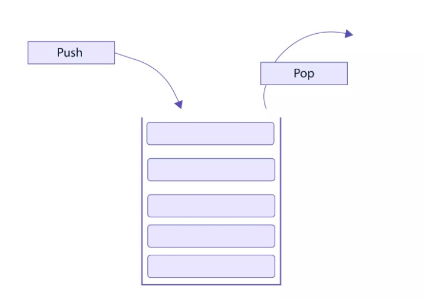

## Understanding the JavaScript Call Stack

# What is a ‘call’?
The call stack is primarily used for function invocation (call)

# How many ‘calls’ can happen at once?
Since the call stack is single, function(s) execution, is done, one at a time, from top to bottom.

# What does LIFO mean?
When we say that the call stack, operates by the data structure principle of Last In, First Out, it means that the last function that gets pushed into the stack is the first to be pop out, when the function returns.

Draw an example of a call stack and the functions that would need to be invoked to generate that call stack.

# What causes a Stack Overflow?
A stack overflow occurs when there is a recursive function (a function that calls itself) without an exit point. 

## JavaScript error messages

# What is a ‘reference error’?
when you try to use a variable that is not yet declared 

# What is a ‘syntax error’?
this occurs when you have something that cannot be parsed in terms of syntax, like when you try to parse an invalid object using JSON.parse.

# What is a ‘range error’?
When you try to manipulate an object with some kind of length and give it an invalid length

# What is a ‘type error’?
this types of errors show up when the types (number, string and so on) you are trying to use or access are incompatible, like accessing a property in an undefined type of variable.

# What is a breakpoint?
Makes your program stop at a certain point if a condition is met.

# What does the word ‘debugger’ do in your code?
Allows you to see the history of your code to determine what is working and being executed.
